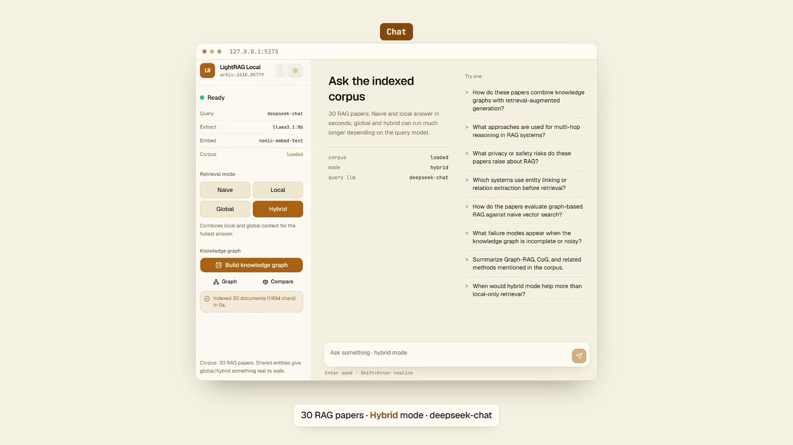

# LightRAG Local

Fully local reproduction of [LightRAG](https://arxiv.org/abs/2410.05779) (arXiv:2410.05779) on **native Windows**. Indexing and chat run on Ollama (LLM + embeddings on your GPU); FastAPI bridges the NetworkX graph store; a React UI covers chat, mode compare, and the knowledge graph. An **optional** cloud LLM judge (e.g. DeepSeek) can score the four modes the way the paper does; generation itself stays local unless you change that.

## Demo

[](demo/brag.mp4)

[Watch the 40-second walkthrough](demo/brag.mp4) — Chat, Graph, and Compare, plus what we actually found when we ran the paper locally (Naive still won the judge; the graph extract is the bottleneck).

**Current workspace state (after a full run on this machine):**

| Item | Value |
| --- | --- |
| Corpus | 30 arXiv RAG-focused papers → `workspace/corpus.txt` |
| Index | All 30 documents `processed` |
| Graph | ~6.5k nodes / ~6.9k edges in `workspace/graph_chunk_entity_relation.graphml` |
| Models | Index/extract: `llama3.1:8b` + `nomic-embed-text`; query can be local 8B or DeepSeek (`LLM_PROVIDER=openai`) |

---

## Stack

| Layer | Choice |
| --- | --- |
| LLM | Ollama `llama3.1:8b` (`num_ctx=8192`) |
| Embeddings | Ollama `nomic-embed-text` (768-d) |
| Graph / KV | NetworkX GraphML + JSON KV under `workspace/` |
| API | FastAPI + [`lightrag-hku`](https://github.com/HKUDS/LightRAG) |
| UI | Vite + React + Tailwind (**amber terminal** theme), Lenis scroll, light/dark |

Tuned for ~8GB VRAM (e.g. RTX 5060 Laptop): `chunk_token_size=512`, `llm_model_max_async=1`, `max_parallel_insert=1`, `MAX_TOTAL_TOKENS=6000`.

---

## Prerequisites

- Windows 10/11
- NVIDIA GPU + recent drivers
- [Node.js 20+](https://nodejs.org) LTS
- [Ollama](https://ollama.com) installed
- ~20GB free disk (models + PDFs + graph)

---

## Quick start

### 1. Bootstrap

From PowerShell in the repo root:

```powershell
Set-ExecutionPolicy -Scope Process Bypass
.\setup.ps1
```

Installs/reuses Miniconda, creates the `lightrag` conda env, installs PyTorch cu128 + Python deps, pulls Ollama models, and scaffolds the frontend if needed.

### 2. Build the corpus (once)

```powershell
conda activate lightrag
python scripts\fetch_and_parse.py
```

Downloads ~30 recent arXiv papers whose abstracts mention *retrieval-augmented generation*, strips References sections, sanitizes special tokens like `<|endoftext|>`, and writes `workspace/corpus.txt`.

### 3. Start Ollama

```powershell
ollama serve
# or launch the Ollama desktop app
```

Confirm: `curl.exe http://127.0.0.1:11434/api/tags`

### 4. Start the API

Cursor / PowerShell often does **not** put conda `Scripts` on PATH after `conda activate`. Prefer:

```powershell
& C:\Users\<you>\miniconda3\envs\lightrag\python.exe -m uvicorn backend.main:app --host 127.0.0.1 --port 8000
```

Or, if `uvicorn` is on PATH:

```powershell
conda activate lightrag
python -m uvicorn backend.main:app --host 127.0.0.1 --port 8000
```

Health check: `curl.exe http://127.0.0.1:8000/health`

### 5. Start the UI

```powershell
cd frontend
npm install   # first time only
npm run dev
```

Open [http://127.0.0.1:5173](http://127.0.0.1:5173). Vite proxies `/api` → `:8000`.

### 6. Index the corpus

**Do not click “Build knowledge graph” more than once** while a run is in progress (the API returns HTTP 409 if a second `/index` is attempted).

```powershell
# PowerShell: use curl.exe (bare `curl` is Invoke-WebRequest)
curl.exe -X POST http://127.0.0.1:8000/index
```

Or use the sidebar button in the UI. Progress is in the **uvicorn** terminal, not the curl window (curl blocks until the whole job finishes).

#### Timing (measured)

| Phase | What we saw |
| --- | --- |
| Per paper | Roughly 8–90+ minutes (depends on length / extract retries) |
| Full 30-paper ingest | On the order of **~20–25 hours wall clock** on 8GB VRAM, often split across pause/resume sessions |
| Early “7–10h” estimate | Too optimistic; it only extrapolated per-chunk smoke tests |

Indexing is **resumable**: already-`processed` papers are skipped; interrupted papers are reset to pending and continued. LLM extract responses are cached under `workspace/kv_store_llm_response_cache.json`.

#### Pause / resume

```powershell
# Pause: stop whatever owns port 8000
Get-NetTCPConnection -LocalPort 8000 | ForEach-Object { Stop-Process -Id $_.OwningProcess -Force }

# Resume later: start API again, then:
curl.exe -X POST http://127.0.0.1:8000/index
```

---

## Using the app

### Chat + mode comparison

Pick a retrieval mode in the sidebar, ask a question, compare answers and latency badges.

| Mode | Behavior | Notes on 8GB |
| --- | --- | --- |
| `naive` | Vector search over chunks only | Fast (~20s typical for a mid-size question) |
| `local` | Entity-neighborhood graph retrieval | Fast (~20s); cites specific papers/entities |
| `global` | Relation / high-level graph retrieval | Can run **very** long; generation may hit token limits |
| `hybrid` | Local + global | Heaviest; same caveats as global |

Example prompt that stresses graph modes:

> How do these papers combine knowledge graphs with retrieval-augmented generation?

On this hardware with **local 8B** generation, **naive** / **local** were ~20s; **global** / **hybrid** could run for many minutes (global once produced huge repetitive answers). With **DeepSeek as query** (same local graph), all four modes finished in ~4–5s. Prefer cloud query for interactive chat; the paper-style judge still favored **naive** until the graph is rebuilt with a stronger extract model.

### Knowledge graph viewer

Sidebar → **Open graph viewer**.

- Force-directed canvas (not a full Gephi clone)
- Default: top **N** nodes by degree (dropdown: 200–all)
- Click a node for type, degree, description
- **Refresh** reloads from disk GraphML

External alternative: open `workspace/graph_chunk_entity_relation.graphml` in [Gephi](https://gephi.org/) or yEd.

### Compare modes (eval dashboard)

Sidebar → **Compare modes**.

Layout inspired by [Chinmoy-04/Rag-eval-engine](https://github.com/Chinmoy-04/Rag-eval-engine) Compare page (summary metrics, latency bars, per-pipeline cards, answer pane), restyled for the amber terminal theme. Data comes from `workspace/mode_comparison.json` via `GET /compare`.

**Paper-style quality comparison (optional, not a full Ragas eval):** score the four saved answers with an LLM judge on the LightRAG paper axes (Comprehensiveness / Diversity / Empowerment):

```powershell
# DeepSeek example
$env:JUDGE_API_KEY = "sk-..."
$env:JUDGE_BASE_URL = "https://api.deepseek.com/v1"
$env:JUDGE_MODEL = "deepseek-chat"
python scripts\paper_compare_judge.py

# Or local Ollama as a weaker free judge
$env:JUDGE_API_KEY = "ollama"
$env:JUDGE_BASE_URL = "http://127.0.0.1:11434/v1"
$env:JUDGE_MODEL = "llama3.1:8b"
python scripts\paper_compare_judge.py
```

Refresh Compare afterward to see the judge panel.

---

## What we actually found (honest notes)

This is a **working LightRAG stack on a laptop**, not a claim that we reproduced the paper’s quality numbers.

### What matches the paper

- Same core idea: chunk → extract entities/relations → NetworkX graph → retrieve with **naive / local / global / hybrid**, then generate.
- Modes behave differently in practice: naive is “vector chunks only,” local hugs entity neighborhoods, global/hybrid pull broader relation context.
- We did a **lightweight LLM-as-judge** on Comprehensiveness / Diversity / Empowerment (the paper’s style of comparison, **not** a full Ragas / formal benchmark suite).

### What does *not* match a paper-grade run

| Paper-ish setup | This machine |
| --- | --- |
| Stronger LLMs for **both** extract and answer | Graph built with `llama3.1:8b`; answers can be local 8B **or** DeepSeek |
| Curated eval questions & multiple datasets | One RAG-focused arXiv corpus (~30 papers), one compare prompt |
| Careful decoding / length control | Local-8B global once printed ~437k chars of fluff (~26 min) |
| Big eval budget | Optional DeepSeek for query + judge (cents), not a full paper redo |

So: **architecture yes, “LightRAG wins the leaderboard” no.**

### Same prompt, two query models

Prompt: *How do these papers combine knowledge graphs with retrieval-augmented generation?*  
Graph + embeddings stayed local (`llama3.1:8b` extract, `nomic-embed-text`). Only the **answer writer** changed.

**Run A: query = local `llama3.1:8b`**

| Mode | Latency | Notes |
| --- | --- | --- |
| naive | ~20s | Concrete; named systems |
| local | ~21s | Thinner / more generic |
| hybrid | ~9 min | Heavy; usable length |
| global | ~26 min | Pathological repetition |

**Run B: query = DeepSeek `deepseek-chat`** (same graph)

| Mode | Latency | Chars |
| --- | --- | --- |
| naive | ~4.2s | ~3.7k |
| local | ~5.1s | ~4.0k |
| global | ~4.1s | ~2.5k |
| hybrid | ~4.7s | ~3.0k |

DeepSeek fixed the “global melts the clock” problem. All four modes became interactive. Cost was negligible on a small prepaid balance.

### Paper-style judge (DeepSeek scoring both runs)

Scores 1–10. Run A’s global answer was truncated for the judge because it was huge.

**Run A (8B answers)**

| Mode | Comp. | Div. | Emp. |
| --- | --- | --- | --- |
| **naive** | 8 | 7 | 8 |
| hybrid | 6 | 6 | 5 |
| global | 5 | 5 | 4 |
| local | 4 | 3 | 4 |

**Run B (DeepSeek answers)**

| Mode | Comp. | Div. | Emp. |
| --- | --- | --- | --- |
| **naive** | 9 | 9 | 8 |
| local | 8 | 7 | 8 |
| hybrid | 7 | 6 | 7 |
| global | 6 | 5 | 6 |

**Winner both times: naive.** Graph modes got *better* with DeepSeek (local jumped hard), but naive stayed ahead. That undercuts the hopeful story that “just use a stronger query model and hybrid will look like the paper.” Writing got cleaner; **what gets retrieved** still comes from an 8B-extracted graph, and on this one prompt the raw chunks still won the judge.

### Takeaway

- Good demo of **how LightRAG feels end-to-end** (index → graph UI → mode compare → paper-style judge).
- Weak evidence for the paper’s quality ranking on this corpus/hardware.
- **Query → DeepSeek:** cheap, fast, stops runaway answers. Worth doing for chat UX.
- **Extract → stronger model + re-index:** the upgrade that would actually stress-test whether local/global/hybrid can beat naive the way the paper claims. We have not done that yet.

Set `LLM_PROVIDER=openai` (plus DeepSeek key / base URL) in `.env` to use cloud for query while keeping Ollama embeddings and the existing graph. See `scripts/run_mode_compare.py` and `scripts/paper_compare_judge.py`.

---

## API

| Method | Path | Purpose |
| --- | --- | --- |
| `GET` | `/health` | Readiness + model names + corpus flag |
| `POST` | `/index` | Ingest `workspace/corpus.txt` (locked; skips already-processed docs) |
| `POST` | `/query` | Body: `{ "prompt": "...", "mode": "hybrid" }` |
| `GET` | `/graph?limit=400` | JSON nodes/links for the UI viewer (highest-degree first if truncated) |
| `GET` | `/compare` | Saved four-mode latency/answer scorecard (`workspace/mode_comparison.json`) |

Query example:

```powershell
curl.exe -s -X POST http://127.0.0.1:8000/query `
  -H "Content-Type: application/json" `
  -d "{\"prompt\":\"What is Graph-RAG?\",\"mode\":\"local\"}"
```

---

## Project layout

```
├── setup.ps1                 # Windows bootstrap
├── requirements.txt
├── README.md
├── backend/main.py           # FastAPI + LightRAG lifespan, /index /query /graph
├── scripts/
│   ├── fetch_and_parse.py       # arXiv → corpus.txt
│   ├── inspect_corpus.py
│   ├── bench_ollama.py
│   ├── probe_queries.py         # arXiv query design helper (not RAG probes)
│   ├── paper_compare_judge.py   # optional DeepSeek/Groq/Ollama mode judge
│   └── run_mode_compare.py      # hit /query for all four modes → mode_comparison.json
├── frontend/                    # React chat + graph + Compare dashboard
└── workspace/                   # gitignored: corpus, PDFs, GraphML, KV, compare JSON
```

---

## Configuration

Environment variables (optional; defaults match the 8GB profile):

| Variable | Default | Notes |
| --- | --- | --- |
| `OLLAMA_HOST` | `http://127.0.0.1:11434` | |
| `LLM_PROVIDER` | `ollama` | `openai` / `deepseek` / `groq` → OpenAI-compatible chat for **query** (+ keywords) |
| `LLM_MODEL` | `llama3.1:8b` (or `deepseek-chat` if provider is openai) | Query + keyword model name |
| `EXTRACT_LLM_MODEL` | same as query, or `llama3.1:8b` when query is cloud | Entity/relation extract; keep local if query is DeepSeek |
| `OPENAI_API_KEY` / `JUDGE_API_KEY` | (none) | Required when `LLM_PROVIDER=openai` |
| `OPENAI_BASE_URL` / `JUDGE_BASE_URL` | `https://api.deepseek.com/v1` | OpenAI-compatible base URL |
| `OPENAI_MAX_TOKENS` | `2048` | Caps cloud answer length (stops runaway global) |
| `EMBEDDING_MODEL` | `nomic-embed-text` | |
| `EMBEDDING_DIM` | `768` | |
| `OLLAMA_NUM_CTX` | `8192` | |
| `CHUNK_SIZE` | `512` | |
| `MAX_TOTAL_TOKENS` | `6000` | Must stay below `num_ctx - 2000` |
| `TIMEOUT` | `0` | Ollama HTTP client timeout; **0 = unlimited** |
| `LLM_WORKER_TIMEOUT` | `3600` | LightRAG worker-queue timeout (seconds); worker aborts at ~2× |

Extraction needs long timeouts: a 240s LightRAG default caused mid-chunk failures on this hardware.

---

## Operational tips

1. **Always start Ollama before the API.** Startup probes embeddings and will fail if Ollama is down.
2. **Use `curl.exe` on PowerShell**, not `curl`.
3. **Use `python -m uvicorn`** if bare `uvicorn` is “not recognized”.
4. **One `/index` at a time.** Concurrent Index from the UI previously produced a false “Indexed 30 docs in 0.2s” while the real job was still running.
5. **failed stubs** in `kv_store_doc_status.json` often mean duplicate re-inserts (`File name already exists`), not missing corpus papers. Trust the `processed` count.
6. Graph grows on disk as papers finish; the viewer reads GraphML from disk (safe during/after index).

---

## Helper scripts

```powershell
conda activate lightrag
python scripts\inspect_corpus.py    # paper count / size
python scripts\bench_ollama.py      # raw Ollama throughput
python scripts\probe_queries.py     # compare arXiv search queries when rebuilding corpus
```

---

## Troubleshooting

| Symptom | Fix |
| --- | --- |
| `uvicorn` not found | `python -m uvicorn ...` with the conda env’s python |
| `Failed to connect to Ollama` | Start `ollama serve`; check `:11434` |
| Index extract timeouts | Ensure `TIMEOUT=0` and `LLM_WORKER_TIMEOUT=3600` (defaults) |
| UI “Indexed in 0.18s” but graph tiny | Spurious concurrent Index; check uvicorn logs for real `[n/30]` progress |
| Global/hybrid hang (local 8B) | Switch query to DeepSeek (`LLM_PROVIDER=openai`) or use `naive`/`local` |

---

## License

Research / local reproduction. LightRAG is from HKUDS (`lightrag-hku`). See upstream licenses for the library and model weights.
